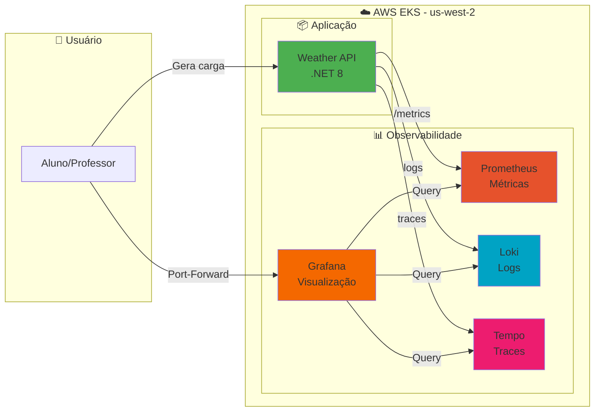

# 🎓 FIAP - Observabilidade no Kubernetes

Projeto completo para aula hands-on de **Observabilidade no Kubernetes** usando **Prometheus, Grafana, Loki e Tempo** com aplicação **.NET 8**.

## 🎯 Objetivo

Demonstrar na prática os **3 pilares da observabilidade** (Métricas, Logs e Traces) em uma aplicação **.NET 8** rodando em **Kubernetes**, com foco em arquitetos .NET que precisam implementar monitoramento em produção.

### **🎓 O que você vai aprender:**
- ✅ **Instrumentação moderna** com OpenTelemetry
- ✅ **Stack completa** de observabilidade (Prometheus + Grafana + Loki + Tempo)
- ✅ **Correlação de dados** entre métricas, logs e traces
- ✅ **Troubleshooting efetivo** usando observabilidade
- ✅ **Deploy em Kubernetes** com service discovery automático

## 🏗️ Arquitetura da Solução



## 🚀 Ambientes Disponíveis

### **🏠 Ambiente Local**
- ✅ **Docker Desktop** + Kubernetes local
- ✅ **Sem custos** de cloud
- ✅ **Sem limitações** de IAM ou budget
- ✅ **Desenvolvimento rápido** - build → deploy → test
- ✅ **Funciona offline**
- 📖 **Guia**: `docs/HANDS-ON-LOCAL.md`

### **☁️ Ambiente AWS EKS**
- ✅ **Multi-node cluster** real
- ✅ **Auto Scaling** de nodes e pods
- ✅ **Integração AWS** completa
- ✅ **Alta disponibilidade**
- ⚠️ **Requer permissões** completas de IAM
- 📖 **Guia**: `docs/HANDS-ON-COMPLETO.md`

## 🛠️ Pré-requisitos

### **🏠 Para Ambiente Local (Docker Desktop)**
```bash
# Verificar Docker Desktop
docker version
docker info

# Verificar Kubernetes local
kubectl version --client
kubectl config current-context  # Deve mostrar: docker-desktop

# Verificar Helm
helm version
```

### **☁️ Para Ambiente AWS EKS**
```bash
# Verificar ferramentas AWS
aws --version
kubectl version --client
helm version

# Configurar AWS (usar profile fiapaws no Learner Lab)
export AWS_PROFILE=fiapaws
export AWS_DEFAULT_REGION=us-west-2
aws sts get-caller-identity
```

### **⚠️ Limitações Conhecidas do AWS Learner Lab**
- ❌ **IAM**: Não permite criação de roles (necessário para EKS)
- ❌ **Budget**: Limite de gastos - se exceder, perde tudo
- ❌ **Instâncias**: Máximo 9 EC2 simultâneas
- ❌ **Regiões**: Apenas `us-east-1` ou `us-west-2`
- ✅ **Solução**: Use `HANDS-ON-LOCAL.md` para Learner Lab

## 📚 Documentação

### **📖 Guias Principais**
- **`docs/HANDS-ON-LOCAL.md`** ⭐ - Ambiente local (Docker Desktop) - **Recomendado para Learner Lab**
- **`docs/HANDS-ON-COMPLETO.md`** - Ambiente AWS EKS completo - **Requer permissões IAM**

### **🛠️ Estrutura do Projeto**
```
📁 fiap-demo-k8s-monitoramento-aws/
├── 📁 src/FiapWeatherApi/          # Aplicação .NET 8 instrumentada
├── 📁 k8s/                         # Manifests Kubernetes (EKS)
├── 📁 k8s-local/                   # Manifests Kubernetes (Local)
├── 📁 docs/                        # Documentação completa
```

### **🎯 Stack Tecnológica**
- **Aplicação**: .NET 8 + OpenTelemetry + Prometheus.NET
- **Orquestração**: Kubernetes (Docker Desktop ou EKS)
- **Métricas**: Prometheus + Grafana
- **Logs**: Loki + Promtail + Grafana
- **Traces**: Tempo + Grafana
- **Alertas**: AlertManager + Grafana
- **HPA**: Metrics Server + Horizontal Pod Autoscaler


## 🚀 Quick Start

### **Para Ambiente Local**
```bash
# Clone o projeto
git clone https://github.com/seu-usuario/fiap-demo-k8s-monitoramento-aws
cd fiap-demo-k8s-monitoramento-aws

# Siga o guia local
open docs/HANDS-ON-LOCAL.md
```

### **Para Ambiente AWS EKS**
```bash
# Clone o projeto
git clone https://github.com/seu-usuario/fiap-demo-k8s-monitoramento-aws
cd fiap-demo-k8s-monitoramento-aws

# Configure AWS
export AWS_PROFILE=seu-profile
aws sts get-caller-identity

# Siga o guia completo
open docs/HANDS-ON-COMPLETO.md
```

---

**🎓 Professor:** José Neto  
**📚 Curso:** Arquitetura de Sistemas .NET - FIAP POS Tech  
**📅 Versão:** Novembro 2025  
