# 🎓 HANDS-ON COMPLETO - Observabilidade no Kubernetes

> **⚠️ IMPORTANTE**: Este hands-on requer permissões completas de IAM para criar clusters EKS. 
> Se estiver usando **AWS Learner Lab**, considere usar o **HANDS-ON-LOCAL.md** que funciona 100% no Docker Desktop.

## 📚 **PARTE 1: Conceitos Fundamentais**

### **🏗️ Arquitetura de Observabilidade no EKS**

```mermaid
graph TB
    subgraph "📈 Camada de Visualização"
        GRAF[Grafana<br/>Dashboards + Alertas + Explore]
    end
    
    subgraph "💾 Camada de Dados"
        PROM[Prometheus<br/>Métricas + Alertas]
        LOKI[Loki<br/>Logs Centralizados]
        TEMPO[Tempo<br/>Distributed Tracing]
    end
    
    subgraph "🚀 Camada de Aplicação"
        APP[Weather API .NET 8<br/>OpenTelemetry + Prometheus.NET<br/>HPA + Service Monitor]
    end
    
    subgraph "☁️ AWS EKS Cluster (us-west-2)"
        NODES[2x t3.medium nodes<br/>Auto Scaling Group]
        METRICS[Metrics Server<br/>HPA Support]
    end
    
    GRAF --> PROM
    GRAF --> LOKI
    GRAF --> TEMPO
    
    PROM --> APP
    LOKI --> APP
    TEMPO --> APP
    
    APP --> NODES
    PROM --> NODES
    LOKI --> NODES
    TEMPO --> NODES
    METRICS --> NODES
    
    style GRAF fill:#F46800
    style PROM fill:#E6522C
    style LOKI fill:#00A3C4
    style TEMPO fill:#ED1C6F
    style APP fill:#4CAF50
    style NODES fill:#326CE5
    style METRICS fill:#FF9800
```



### **🎯 Os 3 Pilares da Observabilidade**

#### **1. MÉTRICAS (Prometheus)**
- **O QUE**: Números que mudam ao longo do tempo
- **EXEMPLOS**: CPU 80%, 500 requests/sec, latência 200ms
- **QUANDO USAR**: Alertas, dashboards, tendências

#### **2. LOGS (Loki)**
- **O QUE**: Eventos textuais com timestamp
- **EXEMPLOS**: "User login failed", "Database connection error"
- **QUANDO USAR**: Debug, auditoria, contexto de erros

#### **3. TRACES (Tempo)**
- **O QUE**: Jornada de uma request através dos serviços
- **EXEMPLOS**: API → Database → Cache → Response
- **QUANDO USAR**: Performance, gargalos, dependências

### **☁️ Vantagens do Ambiente EKS**

- ✅ **Produção real** - ambiente similar ao usado em empresas
- ✅ **Multi-node** - comportamento de cluster verdadeiro
- ✅ **Auto Scaling** - nodes e pods escalam automaticamente
- ✅ **Managed Service** - AWS gerencia o control plane
- ✅ **Integração AWS** - CloudWatch, IAM, Load Balancers
- ✅ **Alta disponibilidade** - distribuição entre AZs

### **🔄 Fluxo de Dados Completo**

```mermaid
sequenceDiagram
    participant User as 👤 Usuário
    participant App as 🚀 Weather API
    participant Prom as 📊 Prometheus
    participant Loki as 📝 Loki
    participant Tempo as 🔗 Tempo
    participant Graf as 📈 Grafana
    
    Note over User,Graf: Request do usuário
    User->>App: GET /api/weather
    
    Note over App: Aplicação processa
    App->>App: Incrementa métricas
    App->>App: Gera logs
    App->>App: Cria trace
    
    Note over Prom,Tempo: Coleta de dados
    Prom->>App: Scrape /metrics (30s)
    App->>Loki: Push logs via Promtail
    App->>Tempo: Export trace via OTLP
    
    Note over Graf: Visualização
    User->>Graf: Acessar dashboard
    Graf->>Prom: Query métricas
    Graf->>Loki: Query logs
    Graf->>Tempo: Query traces
    
    Graf-->>User: Visualização unificada
```



---

## 🚀 **PARTE 2: Preparação do Ambiente**

### **Pré-requisitos**
```bash
# Verificar ferramentas instaladas
aws --version        # AWS CLI
kubectl version      # Kubernetes CLI
helm version         # Package Manager
docker --version     # Container Runtime
```

### **Configurar AWS**
```bash
# Configurar credenciais (usar profile fiapaws)
export AWS_PROFILE=fiapaws
export AWS_DEFAULT_REGION=us-west-2  # Oregon - melhor disponibilidade
aws sts get-caller-identity  # Verificar se está funcionando
```

### **⚠️ Limitações do AWS Learner Lab**
```bash
# IMPORTANTE: O Learner Lab tem limitações de IAM que podem impedir:
# - Criação de roles IAM (necessário para EKS)
# - Criação de clusters EKS com eksctl
# - Algumas operações de tagging

# Se encontrar erro "iam:CreateRole", considere:
# 1. Usar um cluster EKS já existente (se disponível)
# 2. Usar ambiente local (HANDS-ON-LOCAL.md)
# 3. Usar conta AWS pessoal/corporativa
```

---

## ☸️ **PARTE 3: Criando o Cluster Kubernetes**

### **Passo 1: Definir Variáveis**
```bash
# Definir variáveis para facilitar os comandos
export CLUSTER_NAME=fiap-observability
export AWS_REGION=us-west-2
export AWS_PROFILE=fiapaws

# Verificar configuração
echo "Cluster: $CLUSTER_NAME"
echo "Region: $AWS_REGION (Oregon)" 
echo "Profile: $AWS_PROFILE"
aws sts get-caller-identity --profile $AWS_PROFILE
```

### **Passo 2: Criar o Cluster EKS**
```bash
# Criar cluster EKS usando AWS CLI (compatível com Learner Lab)
aws eks create-cluster \
    --name $CLUSTER_NAME \
    --role-arn arn:aws:iam::$(aws sts get-caller-identity --query Account --output text --profile $AWS_PROFILE):role/LabRole \
    --resources-vpc-config subnetIds=$(aws ec2 describe-subnets --filters "Name=default-for-az,Values=true" --query 'Subnets[0:2].SubnetId' --output text --profile $AWS_PROFILE | tr '\t' ','),securityGroupIds=$(aws ec2 describe-security-groups --filters "Name=group-name,Values=default" --query 'SecurityGroups[0].GroupId' --output text --profile $AWS_PROFILE) \
    --region $AWS_REGION \
    --profile $AWS_PROFILE

# ⏰ Aguardar cluster ficar ativo (5-10 minutos)
aws eks wait cluster-active --name $CLUSTER_NAME --region $AWS_REGION --profile $AWS_PROFILE
```

### **Passo 3: Criar Node Group**
```bash
# Criar node group para os workers
aws eks create-nodegroup \
    --cluster-name $CLUSTER_NAME \
    --nodegroup-name fiap-nodegroup \
    --node-role arn:aws:iam::$(aws sts get-caller-identity --query Account --output text --profile $AWS_PROFILE):role/LabRole \
    --subnets $(aws ec2 describe-subnets --filters "Name=default-for-az,Values=true" --query 'Subnets[0:2].SubnetId' --output text --profile $AWS_PROFILE | tr '\t' ' ') \
    --instance-types t3.medium \
    --scaling-config minSize=2,maxSize=4,desiredSize=2 \
    --region $AWS_REGION \
    --profile $AWS_PROFILE

# ⏰ Aguardar node group ficar ativo (3-5 minutos)
aws eks wait nodegroup-active --cluster-name $CLUSTER_NAME --nodegroup-name fiap-nodegroup --region $AWS_REGION --profile $AWS_PROFILE
```

### **Passo 4: Configurar kubectl**
```bash
# Configurar kubectl para usar o cluster
aws eks update-kubeconfig --name $CLUSTER_NAME --region $AWS_REGION --profile $AWS_PROFILE

# ⏰ Enquanto cria, explicar:
# - O que é EKS vs Kubernetes self-managed
# - Por que t3.medium (limitação do Learner Lab)
# - Managed nodes vs self-managed
# - Uso do LabRole existente no Learner Lab
```

### **Passo 5: Verificar o Cluster**
```bash
# Verificar nodes
kubectl get nodes -o wide

# Verificar pods do sistema
kubectl get pods -A

# Verificar contexto
kubectl config current-context

# Verificar status do cluster
aws eks describe-cluster --name $CLUSTER_NAME --region $AWS_REGION --profile $AWS_PROFILE --query 'cluster.status'
```

### **🚨 Troubleshooting: Problemas Comuns**

**Problema 1: Erro de Permissão IAM**
```bash
# Se ainda encontrar erro "iam:CreateRole":
# 1. Verificar se LabRole existe
aws iam get-role --role-name LabRole --profile $AWS_PROFILE

# 2. Usar ambiente local como alternativa
# Siga o HANDS-ON-LOCAL.md que usa Docker Desktop

# 3. Usar conta AWS pessoal/corporativa
# Com permissões completas de IAM
```

**Problema 2: Subnets não encontradas**
```bash
# Listar subnets disponíveis
aws ec2 describe-subnets --query 'Subnets[*].[SubnetId,AvailabilityZone,DefaultForAz]' --output table --profile $AWS_PROFILE

# Se necessário, especificar subnets manualmente
# Substitua SUBNET-1 e SUBNET-2 pelos IDs reais
aws eks create-cluster \
    --name $CLUSTER_NAME \
    --role-arn arn:aws:iam::$(aws sts get-caller-identity --query Account --output text --profile $AWS_PROFILE):role/LabRole \
    --resources-vpc-config subnetIds=SUBNET-1,SUBNET-2 \
    --region $AWS_REGION \
    --profile $AWS_PROFILE
```

**✅ CHECKPOINT**: Cluster funcionando com 2 nodes

---

## 📊 **PARTE 4: Instalando Prometheus**

### **Passo 1: Preparar o Helm**
```bash
# Adicionar repositório do Prometheus
helm repo add prometheus-community https://prometheus-community.github.io/helm-charts
helm repo update

# Ver charts disponíveis
helm search repo prometheus-community
```

### **Passo 2: Criar Namespace**
```bash
# Criar namespace para organização
kubectl create namespace monitoring

# Verificar
kubectl get namespaces
```

### **Passo 3: Instalar Prometheus Stack**
```bash
# Instalar kube-prometheus-stack (Prometheus + Grafana + AlertManager)
helm install prometheus prometheus-community/kube-prometheus-stack \
  --namespace monitoring \
  --set grafana.adminPassword=fiap2025 \
  --wait

# ⏰ Enquanto instala, explicar:
# - O que é o kube-prometheus-stack
# - Prometheus Operator
# - ServiceMonitors e PodMonitors
# - Por que usar Helm
```

### **Passo 4: Verificar Instalação**
```bash
# Ver pods criados
kubectl get pods -n monitoring

# Ver services
kubectl get svc -n monitoring

# Ver storage (PVCs)
kubectl get pvc -n monitoring
```

**✅ CHECKPOINT**: Prometheus stack funcionando

---

## 🎨 **PARTE 5: Acessando o Grafana**

### **Passo 1: Port-Forward**
```bash
# Fazer port-forward para acessar Grafana
kubectl port-forward svc/prometheus-grafana 3000:80 -n monitoring

# Em outro terminal, fazer port-forward para Prometheus
kubectl port-forward svc/prometheus-kube-prometheus-prometheus 9090:9090 -n monitoring
```

### **Passo 2: Acessar Interfaces**
```bash
# Abrir no browser:
# Grafana: http://localhost:3000
# Usuário: admin
# Senha: fiap2025

# Prometheus: http://localhost:9090
```

### **Passo 3: Explorar o Grafana**
```bash
# No Grafana, mostrar:
# 1. Dashboard já existente (Kubernetes / Compute Resources)
# 2. Data Sources (Prometheus já configurado)
# 3. Explore (fazer query simples)
```

**✅ CHECKPOINT**: Grafana acessível e funcionando

---

## 🚀 **PARTE 6: Preparando Nossa Aplicação .NET**

### **Passo 1: Entender a Aplicação**
```bash
# Navegar para o código fonte
cd src/FiapWeatherApi

# Mostrar arquivos importantes:
ls -la
# - Program.cs (configuração OpenTelemetry)
# - Controllers/WeatherController.cs (instrumentação)
# - FiapWeatherApi.csproj (dependências)
# - Dockerfile (containerização)
```

### **Passo 2: Explicar a Instrumentação**
```csharp
// No Program.cs, explicar:

// 1. OpenTelemetry para traces
.AddOpenTelemetry()
.WithTracing(...)
.AddOtlpExporter()  // Para Tempo

// 2. Prometheus.NET para métricas
.AddPrometheusExporter()

// 3. Health checks
.AddHealthChecks()
```

### **Passo 3: Criar ECR Repository**
```bash
# Criar repositório no ECR
aws ecr create-repository \
    --repository-name fiap-weather-api \
    --region $AWS_REGION \
    --profile $AWS_PROFILE

# Obter URL do repositório
export ECR_REGISTRY=$(aws sts get-caller-identity --query Account --output text --profile $AWS_PROFILE).dkr.ecr.$AWS_REGION.amazonaws.com
export ECR_REPOSITORY=$ECR_REGISTRY/fiap-weather-api
echo "ECR Repository: $ECR_REPOSITORY"
```

### **Passo 4: Build e Push da Imagem**

> **🏗️ IMPORTANTE - Arquiteturas**: 
> - **Mac M1/M2**: Usa arquitetura ARM64
> - **EKS Nodes**: Usam arquitetura AMD64 (x86_64)
> - **Solução**: Build cross-platform com `--platform linux/amd64`

```bash
# Fazer login no ECR
aws ecr get-login-password --region $AWS_REGION --profile $AWS_PROFILE | \
    docker login --username AWS --password-stdin $ECR_REGISTRY

# Build da imagem para AMD64 (compatível com nodes EKS)
# Importante: Mac M1/M2 usa ARM, mas EKS usa AMD64
docker build --platform linux/amd64 -t $ECR_REPOSITORY:v1 .

# Verificar imagem criada
docker images | grep fiap-weather-api

# Verificar arquitetura da imagem
docker inspect $ECR_REPOSITORY:v1 --format='{{.Architecture}}'

# Push para ECR
docker push $ECR_REPOSITORY:v1

# ⏰ Explicar enquanto faz push:
# - Multi-stage build
# - Otimização de layers
# - .NET 8 runtime vs SDK
# - ECR como registry privado da AWS
# - Cross-platform build: Mac ARM → Linux AMD64
```

### **🚨 Troubleshooting ECR**

**Problema 1: Erro de autenticação no ECR**
```bash
# Re-fazer login no ECR
aws ecr get-login-password --region $AWS_REGION --profile $AWS_PROFILE | \
    docker login --username AWS --password-stdin $ECR_REGISTRY

# Verificar se o repositório existe
aws ecr describe-repositories --repository-names fiap-weather-api --region $AWS_REGION --profile $AWS_PROFILE
```

**Problema 2: ImagePullBackOff no Kubernetes**
```bash
# Verificar se a imagem existe no ECR
aws ecr list-images --repository-name fiap-weather-api --region $AWS_REGION --profile $AWS_PROFILE

# Verificar logs do pod
kubectl describe pod -l app=weather-api
kubectl logs -l app=weather-api
```

**Problema 3: Erro de Arquitetura (Mac M1/M2)**
```bash
# Se o pod falhar com "exec format error":
# Verificar arquitetura da imagem
docker inspect $ECR_REPOSITORY:v1 --format='{{.Architecture}}'

# Se mostrar "arm64", rebuild para amd64:
docker build --platform linux/amd64 -t $ECR_REPOSITORY:v1 .
docker push $ECR_REPOSITORY:v1

# Alternativa: Usar buildx para multi-platform
docker buildx create --use
docker buildx build --platform linux/amd64 -t $ECR_REPOSITORY:v1 . --push
```

**✅ CHECKPOINT**: Aplicação containerizada e no ECR

---

## 📦 **PARTE 7: Deploy da Aplicação**

### **Passo 1: Atualizar Deployment com Imagem ECR**
```bash
# Obter Account ID
export ACCOUNT_ID=$(aws sts get-caller-identity --query Account --output text --profile $AWS_PROFILE)
echo "Account ID: $ACCOUNT_ID"

# Substituir ACCOUNT_ID no deployment
sed -i.bak "s/ACCOUNT_ID/$ACCOUNT_ID/g" k8s/app/deployment.yaml

# Verificar se a substituição funcionou
grep "image:" k8s/app/deployment.yaml
```

### **Passo 2: Deploy da Aplicação**
```bash
# Aplicar manifests da aplicação
kubectl apply -f k8s/app/deployment.yaml
kubectl apply -f k8s/app/service.yaml

# Verificar deployment
kubectl get pods -l app=weather-api
kubectl get svc weather-api

# Aguardar pods ficarem prontos
kubectl wait --for=condition=ready pod -l app=weather-api --timeout=300s
```

### **Passo 4: Testar Aplicação**
```bash
# Port-forward para testar
kubectl port-forward svc/weather-api 8080:80

# Em outro terminal, testar:
curl http://localhost:8080/health
curl http://localhost:8080/api/weather
curl http://localhost:8080/metrics  # Ver métricas Prometheus
```

**✅ CHECKPOINT**: Aplicação rodando e expondo métricas

---

## 🔍 **PARTE 8: Configurando Monitoramento da App**

### **Passo 1: Configurar ServiceMonitor**
```bash
# Aplicar ServiceMonitor (já pronto)
kubectl apply -f k8s/monitoring/servicemonitor.yaml

# Verificar
kubectl get servicemonitor
```

### **Passo 2: Verificar no Prometheus**
```bash
# Acessar Prometheus: http://localhost:9090
# Ir em Status → Targets
# Procurar por: serviceMonitor/default/weather-api-metrics/0
# Status deve estar "UP"
```

### **Passo 3: Testar Queries**
```promql
# No Prometheus, testar queries:

# 1. Métricas básicas da aplicação
weather_requests_total

# 2. Rate de requests
rate(weather_requests_total[5m])

# 3. Latência P95
histogram_quantile(0.95, rate(weather_request_duration_seconds_bucket[5m]))

# 4. CPU da aplicação
rate(container_cpu_usage_seconds_total{pod=~"weather-api-.*"}[5m]) * 100
```

**✅ CHECKPOINT**: Aplicação sendo monitorada pelo Prometheus

---

## 📊 **PARTE 9: Criando Dashboard no Grafana**

### **Passo 1: Criar Dashboard Básico**
```bash
# No Grafana (http://localhost:3000):
# 1. + → Dashboard
# 2. Add visualization
# 3. Data source: Prometheus
```

### **Passo 2: Adicionar Painéis**

#### **Painel 1: Request Rate**
```promql
# Query: rate(weather_requests_total[5m])
# Title: "Requests per Second"
# Type: Time series
```

#### **Painel 2: Response Time**
```promql
# Query: histogram_quantile(0.95, rate(weather_request_duration_seconds_bucket[5m]))
# Title: "Response Time P95"
# Type: Time series
# Unit: seconds
```

#### **Painel 3: CPU Usage**
```promql
# Query: rate(container_cpu_usage_seconds_total{pod=~"weather-api-.*"}[5m]) * 100
# Title: "CPU Usage %"
# Type: Time series
# Unit: percent
```

#### **Painel 4: Memory Usage**
```promql
# Query: container_memory_working_set_bytes{pod=~"weather-api-.*"}
# Title: "Memory Usage"
# Type: Time series
# Unit: bytes
```

### **Passo 3: Salvar Dashboard**
```bash
# Salvar como: "FIAP - Weather API Monitoring"
# Tags: fiap, weather-api, monitoring
```

**✅ CHECKPOINT**: Dashboard básico funcionando

---

## 📝 **PARTE 10: Adicionando Loki para Logs**

### **Passo 1: Instalar Loki**
```bash
# Aplicar Loki otimizado para EKS
kubectl apply -f k8s/monitoring/loki.yaml

# Aplicar Promtail otimizado para EKS
kubectl apply -f k8s/monitoring/promtail.yaml

# Aguardar Loki ficar pronto
kubectl wait --for=condition=ready pod -l app=loki -n monitoring --timeout=300s
```

### **Passo 2: Verificar Instalação**
```bash
# Ver pods do Loki e Promtail
kubectl get pods -n monitoring | grep -E "(loki|promtail)"

# Ver services
kubectl get svc -n monitoring | grep loki

# Aguardar pods ficarem prontos
kubectl wait --for=condition=ready pod -l app=loki -n monitoring --timeout=300s
```


### **Passo 3: Configurar Loki no Grafana**

> **🌐 IMPORTANTE - FQDNs no Kubernetes**: 
> - **Formato**: `http://SERVICE_NAME.NAMESPACE.svc.cluster.local:PORT`
> - **Loki**: `http://loki.monitoring.svc.cluster.local:3100`
> - **Tempo**: `http://tempo.monitoring.svc.cluster.local:3200`
> - **Prometheus**: `http://prometheus-kube-prometheus-prometheus.monitoring.svc.cluster.local:9090`

```bash
# No Grafana:
# 1. Configuration → Data sources
# 2. Add data source → Loki
# 3. URL: http://loki.monitoring.svc.cluster.local:3100
# 4. Save & test

# ⚠️ IMPORTANTE: Usar sempre FQDN completo no Grafana
# Nomes curtos (como "loki:3100") podem não resolver corretamente

# Para verificar nomes dos serviços:
kubectl get svc -n monitoring
```

### **Passo 4: Explorar Logs**
```bash
# No Grafana → Explore → Loki:

# Query 1: Logs da nossa aplicação
{namespace="default", app="weather-api"}

# Query 2: Logs de erro
{namespace="default", app="weather-api"} |= "ERROR"

# Query 3: Rate de logs
rate({namespace="default", app="weather-api"}[5m])

# Query 4: Todos os labels disponíveis
{namespace="default"}
```

**✅ CHECKPOINT**: Logs centralizados no Loki

---

## 🔗 **PARTE 11: Adicionando Tempo para Traces**

### **Passo 1: Deploy do Tempo**
```bash
# Aplicar Tempo otimizado para EKS
kubectl apply -f k8s/monitoring/tempo.yaml

# Verificar pods e services
kubectl get pods -n monitoring | grep tempo
kubectl get svc -n monitoring | grep tempo

# Aguardar pod ficar pronto
kubectl wait --for=condition=ready pod -l app=tempo -n monitoring --timeout=300s
```

### **Passo 2: Atualizar Aplicação para Tempo**
```bash
# A aplicação já está configurada com variáveis de ambiente para OpenTelemetry
# Verificar se deployment está atualizado
kubectl apply -f k8s/app/deployment.yaml

# Aguardar rollout (se necessário)
kubectl rollout status deployment weather-api
```

### **Passo 3: Configurar Tempo no Grafana**
```bash
# No Grafana:
# 1. Configuration → Data sources
# 2. Add data source → Tempo
# 3. URL: http://tempo.monitoring.svc.cluster.local:3200
# 4. Save & test

# ⚠️ IMPORTANTE: Usar FQDN completo (como mostrado acima)
# Formato: http://SERVICE_NAME.NAMESPACE.svc.cluster.local:PORT
```

### **Passo 4: Testar Traces**
```bash
# Gerar traces
for i in {1..15}; do
  curl http://localhost:8080/api/weather
  echo "Trace $i enviado"
  sleep 2
done

# Aguardar 2-3 minutos para traces aparecerem

# No Grafana → Explore → Tempo:
# 1. Query Type: Search (recomendado)
# 2. Service Name: fiap-weather-api
# 3. Run query
# 4. Clicar em um trace para ver detalhes

# Nota: Se TraceQL não funcionar, use apenas Search
```

**✅ CHECKPOINT**: Traces funcionando no Tempo

---

## 🧪 **PARTE 12: Teste de Carga e Observação**

### **Passo 1: Gerar Carga**
```bash
# Instalar hey (ferramenta de load test)
# macOS: brew install hey
# Linux: go install github.com/rakyll/hey@latest

# Gerar carga por 2 minutos
hey -z 2m -c 10 -q 5 http://localhost:8080/api/weather
```

### **Passo 2: Observar em Tempo Real**
```bash
# No Grafana, observar:
# 1. Dashboard da aplicação
#    - Request rate aumentando
#    - Response time variando
#    - CPU/Memory subindo

# 2. Explore → Loki
#    - Logs das requests em tempo real

# 3. Explore → Tempo
#    - Traces das requests sendo criados
```

### **Passo 3: Correlacionar Dados**
```bash
# Demonstrar correlação:
# 1. Ver pico de latência no dashboard
# 2. Buscar logs no mesmo horário
# 3. Analisar trace específico do período
# 4. Identificar possível gargalo
```

**✅ CHECKPOINT**: Observabilidade completa funcionando

---

## 🎯 **PARTE 13: Configurando Alertas**

### **Passo 1: Instalar Metrics Server (se necessário)**
```bash
# Verificar se metrics-server já existe no EKS
kubectl get pods -n kube-system | grep metrics-server

# Se não existir, instalar:
kubectl apply -f https://github.com/kubernetes-sigs/metrics-server/releases/latest/download/components.yaml

# Aguardar ficar pronto
kubectl wait --for=condition=ready pod -l k8s-app=metrics-server -n kube-system --timeout=120s

# Testar
kubectl top nodes
```

### **Passo 2: Configurar Alertas e HPA**
```bash
# Aplicar alertas customizados (já prontos)
kubectl apply -f k8s/monitoring/prometheus-rules.yaml

# Aplicar HPA para auto-scaling
kubectl apply -f k8s/monitoring/hpa.yaml

# Verificar
kubectl get prometheusrule -n monitoring
kubectl get hpa
kubectl describe hpa weather-api-hpa
```

### **Passo 3: Verificar Alertas**
```bash
# No Prometheus (http://localhost:9090):
# 1. Ir em Alerts
# 2. Ver regras carregadas
# 3. Status: Inactive (esperado)

# No Grafana:
# 1. Alerting → Alert Rules
# 2. Ver regras importadas do Prometheus
```

**✅ CHECKPOINT**: Alertas configurados

---

## 🎉 **PARTE 14: Demonstração Final**

### **Cenário: Simulando um Problema**
```bash
# 1. Simular alta latência (modificar código ou usar endpoint lento)
# 2. Gerar carga para disparar alerta
# 3. Mostrar workflow completo:
```

### **Workflow de Troubleshooting**
```bash
# 1. 🚨 ALERTA: "High latency detected"
#    → Prometheus → Alerts (firing)

# 2. 📊 DASHBOARD: Identificar problema
#    → Grafana → Weather API Dashboard
#    → Ver pico de latência

# 3. 📝 LOGS: Investigar contexto
#    → Grafana → Explore → Loki
#    → Buscar logs do período com problema

# 4. 🔗 TRACES: Analisar request específica
#    → Grafana → Explore → Tempo
#    → Encontrar trace lento
#    → Identificar gargalo específico

# 5. 🎯 ROOT CAUSE: Correlacionar tudo
#    → Métrica + Log + Trace = Solução
```

---

## 🧹 **LIMPEZA DO AMBIENTE**

```bash
# Parar port-forwards
pkill -f "kubectl port-forward"

# Deletar aplicação
kubectl delete -f k8s/app/

# Deletar monitoramento
kubectl delete -f k8s/monitoring/

# Desinstalar Helm charts
helm uninstall prometheus -n monitoring

# Deletar namespace
kubectl delete namespace monitoring

# Deletar node group primeiro
aws eks delete-nodegroup --cluster-name $CLUSTER_NAME --nodegroup-name fiap-nodegroup --region $AWS_REGION --profile $AWS_PROFILE

# Aguardar node group ser deletado
aws eks wait nodegroup-deleted --cluster-name $CLUSTER_NAME --nodegroup-name fiap-nodegroup --region $AWS_REGION --profile $AWS_PROFILE

# Deletar repositório ECR
aws ecr delete-repository --repository-name fiap-weather-api --force --region $AWS_REGION --profile $AWS_PROFILE

# Deletar cluster (CUIDADO!)
aws eks delete-cluster --name $CLUSTER_NAME --region $AWS_REGION --profile $AWS_PROFILE
```

---

**🎓 Parabéns! Você implementou observabilidade completa no Kubernetes!**

**Professor:** José Neto  
**Curso:** Arquitetura de Sistemas .NET - FIAP POS Tech  
