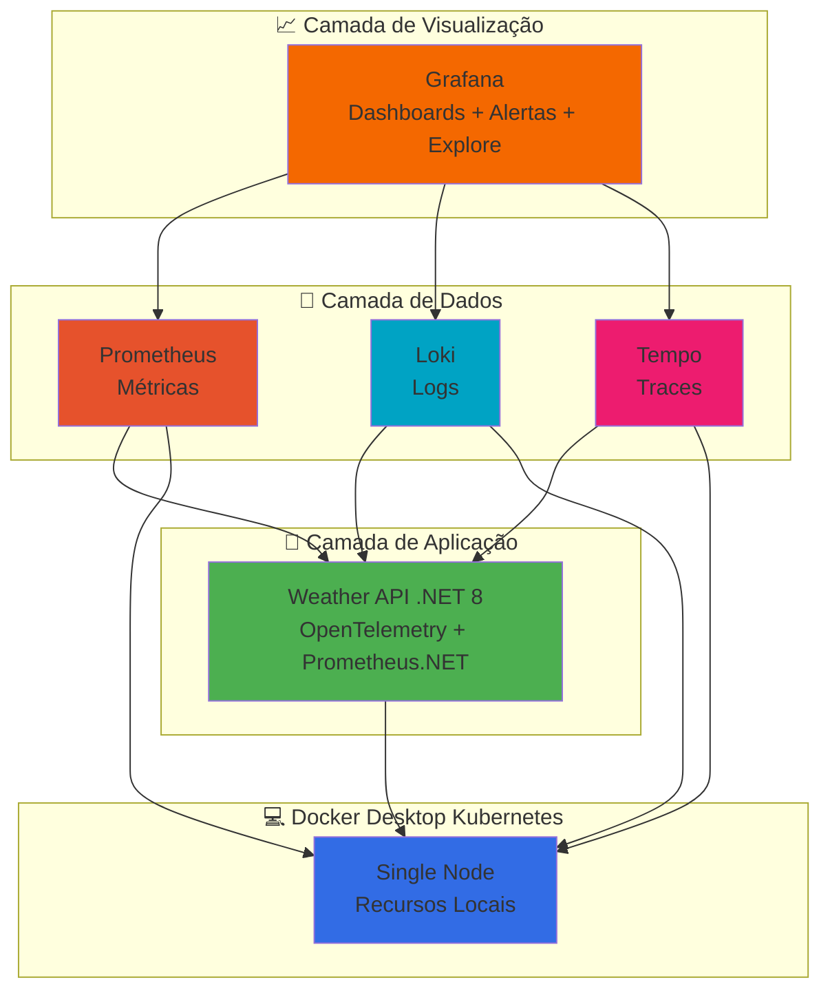
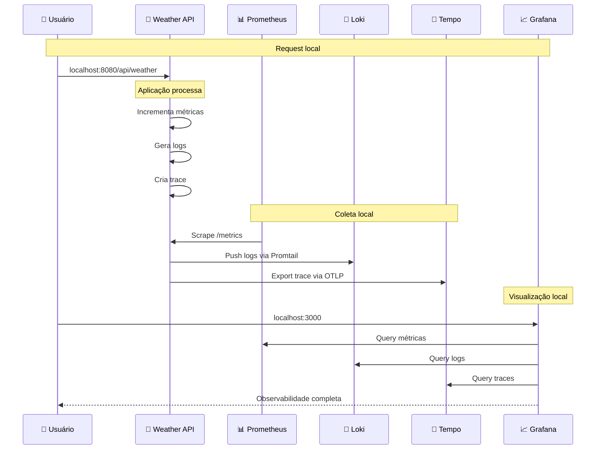

# 🏠 HANDS-ON LOCAL - Observabilidade no Docker Desktop

Versão **100% local** do hands-on de observabilidade usando **Docker Desktop + Kubernetes** integrado.

---

## 🏗️ **Arquitetura de Observabilidade Local**



### **🔄 Fluxo de Dados Local**



### **🎯 Os 3 Pilares da Observabilidade**

#### **1. MÉTRICAS (Prometheus)**
- **O QUE**: Números que mudam ao longo do tempo
- **EXEMPLOS**: CPU 80%, 500 requests/sec, latência 200ms
- **QUANDO USAR**: Alertas, dashboards, tendências

#### **2. LOGS (Loki)**
- **O QUE**: Eventos textuais com timestamp
- **EXEMPLOS**: "User login failed", "Database connection error"
- **QUANDO USAR**: Debug, auditoria, contexto de erros

#### **3. TRACES (Tempo)**
- **O QUE**: Jornada de uma request através dos serviços
- **EXEMPLOS**: API → Database → Cache → Response
- **QUANDO USAR**: Performance, gargalos, dependências

### **💡 Vantagens do Ambiente Local**

- ✅ **Sem custos** de cloud
- ✅ **Desenvolvimento rápido** - build → deploy → test
- ✅ **Offline** - funciona sem internet
- ✅ **Recursos dedicados** - usa CPU/RAM da máquina
- ✅ **Persistência** - dados mantidos entre sessões
- ✅ **Experimentação** - quebrar e consertar sem medo

---

## 🛠️ **Pré-requisitos**

### **1. Docker Desktop**
```bash
# Verificar se Docker Desktop está rodando
docker version
docker info

# Verificar se Kubernetes está habilitado
kubectl cluster-info
kubectl get nodes
```

### **2. Ferramentas Necessárias**
```bash
# Verificar ferramentas
kubectl version --client
helm version
docker --version

# Opcional: hey para testes de carga
# macOS: brew install hey
# Windows: choco install hey
# Linux: go install github.com/rakyll/hey@latest
```

### **3. Configurar Docker Desktop**
1. **Abrir Docker Desktop**
2. **Settings → Kubernetes**
3. **✅ Enable Kubernetes**
4. **Apply & Restart**
5. **Aguardar** Kubernetes ficar verde

### **4. Recursos Recomendados**
```
Docker Desktop Settings → Resources:
- CPU: 4+ cores
- Memory: 8GB+ RAM
- Disk: 20GB+ disponível
```

---

## 🚀 **PARTE 1: Preparação do Ambiente**

### **Passo 1: Verificar Cluster Local**
```bash
# Verificar contexto atual
kubectl config current-context
# Deve mostrar: docker-desktop

# Verificar nodes
kubectl get nodes
# Deve mostrar 1 node: docker-desktop

# Verificar pods do sistema
kubectl get pods -A
```

### **Passo 2: Criar Namespace**
```bash
# Criar namespace para monitoramento
kubectl create namespace monitoring

# Verificar
kubectl get namespaces
```

**✅ CHECKPOINT**: Cluster local funcionando

---

## 📊 **PARTE 2: Instalar Prometheus + Grafana**

### **Passo 1: Adicionar Repositório Helm**
```bash
# Adicionar repo do Prometheus
helm repo add prometheus-community https://prometheus-community.github.io/helm-charts
helm repo update

# Verificar repo
helm search repo prometheus-community/kube-prometheus-stack
```

### **Passo 2: Instalar Stack Completa**
```bash
# Instalar Prometheus + Grafana + AlertManager (otimizado para Docker Desktop)
helm install prometheus prometheus-community/kube-prometheus-stack \
  --namespace monitoring \
  --set grafana.adminPassword=admin123 \
  --set prometheus.prometheusSpec.storageSpec.volumeClaimTemplate.spec.resources.requests.storage=5Gi \
  --set grafana.persistence.enabled=true \
  --set grafana.persistence.size=2Gi \
  --set nodeExporter.enabled=false \
  --set prometheus-node-exporter.enabled=false \
  --set kubeStateMetrics.enabled=true \
  --wait

# ⏰ Aguardar instalação (2-3 minutos)
```

### **Passo 3: Verificar Instalação**
```bash
# Verificar pods
kubectl get pods -n monitoring

# Verificar services
kubectl get svc -n monitoring

# Aguardar todos os pods ficarem Running
watch kubectl get pods -n monitoring
```

### **Passo 4: Configurar Port-Forwards**
```bash
# Grafana (em terminal separado)
kubectl port-forward svc/prometheus-grafana 3000:80 -n monitoring &

# Prometheus (em terminal separado)
kubectl port-forward svc/prometheus-kube-prometheus-prometheus 9090:9090 -n monitoring &

# Verificar se está funcionando
curl http://localhost:3000  # Grafana
curl http://localhost:9090  # Prometheus
```

### **Passo 5: Acessar Grafana**
```bash
# Abrir no navegador
open http://localhost:3000  # macOS
# ou acesse manualmente: http://localhost:3000

# Login:
# User: admin
# Password: admin123
```

### **🚨 Troubleshooting: Node-Exporter CrashLoopBackOff**

**Por que desabilitamos o node-exporter?**
- O `node-exporter` coleta métricas do sistema operacional host
- No Docker Desktop, ele não consegue acessar corretamente o sistema de arquivos
- Para ambiente local, focamos nas métricas da aplicação (mais importantes para aprendizado)
- Em produção real (EKS), o node-exporter funciona normalmente

Se você já instalou e está com erro no `node-exporter`, execute:

```bash
# Desinstalar a instalação atual
helm uninstall prometheus -n monitoring

# Aguardar limpeza
kubectl get pods -n monitoring
# Aguardar até não haver pods

# Reinstalar com configuração correta
helm install prometheus prometheus-community/kube-prometheus-stack \
  --namespace monitoring \
  --set grafana.adminPassword=admin123 \
  --set prometheus.prometheusSpec.storageSpec.volumeClaimTemplate.spec.resources.requests.storage=5Gi \
  --set grafana.persistence.enabled=true \
  --set grafana.persistence.size=2Gi \
  --set nodeExporter.enabled=false \
  --set prometheus-node-exporter.enabled=false \
  --set kubeStateMetrics.enabled=true \
  --wait

# Verificar se todos os pods estão Running (sem node-exporter)
kubectl get pods -n monitoring
```

**✅ CHECKPOINT**: Prometheus e Grafana funcionando

---

## 🔍 **PARTE 3: Configurar Monitoramento**

# Build da imagem (usando Docker Desktop)
docker build -t fiap-weather-api:local .

# Verificar imagem criada
docker images | grep fiap-weather-api

# Testar imagem localmente
docker run -p 8081:80 fiap-weather-api:local &
curl http://localhost:8081/health
curl http://localhost:8081/metrics

# Parar container de teste
docker stop $(docker ps -q --filter ancestor=fiap-weather-api:local)
```

### **Passo 2: Deploy no Kubernetes Local**
```bash
# Voltar para raiz do projeto
cd ../..

# Aplicar manifests da aplicação (versão local)
kubectl apply -f k8s-local/app/deployment-local.yaml
kubectl apply -f k8s-local/app/service-local.yaml

# Verificar deployment
kubectl get pods -l app=weather-api
kubectl get svc weather-api

# Aguardar pods ficarem Running
kubectl wait --for=condition=ready pod -l app=weather-api --timeout=60s
```

### **Passo 3: Configurar Port-Forwards**
```bash
# Port-forward da aplicação
kubectl port-forward svc/weather-api 8080:80 &

# Verificar se está funcionando
curl http://localhost:8080/health
# Deve retornar: Healthy
```

### **Passo 4: Testar Aplicação**
```bash
# Testar endpoints
curl http://localhost:8080/api/weather
curl http://localhost:8080/metrics

# Gerar algumas métricas
for i in {1..10}; do
  curl http://localhost:8080/api/weather
  sleep 1
done
```

**✅ CHECKPOINT**: Aplicação rodando e expondo métricas

---

## 🔍 **PARTE 4: Configurar Monitoramento**

### **Passo 1: Aplicar ServiceMonitor**
```bash
# Aplicar ServiceMonitor para descoberta automática (usar o original)
kubectl apply -f k8s/monitoring/servicemonitor.yaml

# Verificar
kubectl get servicemonitor
```

### **Passo 2: Verificar no Prometheus**
```bash
# Acessar Prometheus: http://localhost:9090
# 1. Status → Targets
# 2. Procurar por: serviceMonitor/default/weather-api-metrics/0
# 3. Status deve estar "UP"

# Testar queries no Prometheus:
# - weather_requests_total
# - weather_request_duration_seconds
# - up{job="weather-api"}
```

### **Passo 3: Verificar no Grafana**
```bash
# Acessar Grafana: http://localhost:3000
# 1. Explore → Prometheus
# 2. Testar query: weather_requests_total
# 3. Ver métricas da aplicação
```

**✅ CHECKPOINT**: Métricas sendo coletadas

---

## 📝 **PARTE 5: Instalar Loki para Logs**

### **Passo 1: Deploy do Loki**
```bash
# Aplicar Loki (versão local)
kubectl apply -f k8s-local/monitoring/loki-local.yaml

# Aplicar Promtail para coleta de logs (versão local)
kubectl apply -f k8s-local/monitoring/promtail-local.yaml

# Verificar instalação
kubectl get pods -n monitoring | grep loki
kubectl get pods -n monitoring | grep promtail

# Aguardar pods ficarem Running
kubectl wait --for=condition=ready pod -l app=loki -n monitoring --timeout=120s
```

### **Passo 2: Configurar Loki no Grafana**
```bash
# No Grafana (http://localhost:3000):
# 1. Configuration → Data sources
# 2. Add data source → Loki
# 3. URL: http://loki:3100
# 4. Save & test
```

### **Passo 3: Testar Logs**
```bash
# Gerar logs na aplicação
for i in {1..5}; do
  curl http://localhost:8080/api/weather
  sleep 2
done

# No Grafana → Explore → Loki:
# Query: {namespace="default", app="weather-api"}
```

**✅ CHECKPOINT**: Logs centralizados

---

## 🔗 **PARTE 6: Instalar Tempo para Traces**

### **Passo 1: Deploy do Tempo (Versão Simplificada)**
```bash
# Aplicar Tempo simplificado (mais estável para ambiente local)
kubectl apply -f k8s-local/monitoring/tempo-simple.yaml

# Verificar
kubectl get pods -n monitoring | grep tempo-simple
kubectl get svc -n monitoring | grep tempo-simple

# Aguardar pod ficar pronto (pode demorar 60s)
kubectl wait --for=condition=ready pod -l app=tempo-simple -n monitoring --timeout=120s
```

### **Passo 2: Atualizar Aplicação para Tempo**
```bash
# Rebuild da aplicação com configuração correta
cd src/FiapWeatherApi
docker build -t fiap-weather-api:local .
cd ../..

# Atualizar deployment da aplicação
kubectl apply -f k8s-local/app/deployment-local.yaml

# Aguardar rollout completar
kubectl rollout status deployment weather-api

# Recriar port-forward
pkill -f "kubectl port-forward.*weather-api"
kubectl port-forward svc/weather-api 8080:80 &
```

### **Passo 3: Configurar Tempo no Grafana**
```bash
# No Grafana (http://localhost:3000):
# 1. Configuration → Data sources
# 2. Add data source → Tempo
# 3. URL: http://tempo-simple:3200
# 4. Save & test
```

### **Passo 4: Testar Traces**
```bash
# Gerar traces
for i in {1..15}; do
  curl http://localhost:8080/api/weather
  echo "Trace $i enviado"
  sleep 2
done

# Aguardar 2-3 minutos para traces aparecerem no Grafana
```

### **Passo 5: Consultar Traces no Grafana**

**✅ Método Recomendado: Search**
```
No Grafana → Explore → Tempo:
1. Query Type: Search
2. Service Name: fiap-weather-api
3. Run query
4. Clicar em um trace para ver detalhes
```

**⚠️ TraceQL: Pode não funcionar em ambiente local**
```
Se quiser tentar TraceQL:
1. Query Type: TraceQL
2. Query: { .service.name = "fiap-weather-api" }
3. Run query

Nota: Se der erro 404, use apenas Search
```

**✅ CHECKPOINT**: Traces funcionando

---

## 🚨 **PARTE 7: Configurar Alertas e HPA**

### **Passo 1: Instalar Metrics Server (Necessário para HPA)**
```bash
# Instalar metrics-server oficial
kubectl apply -f https://github.com/kubernetes-sigs/metrics-server/releases/latest/download/components.yaml

# Patch para funcionar no Docker Desktop (aceitar certificados inseguros)
kubectl patch deployment metrics-server -n kube-system --type='merge' -p='{"spec":{"template":{"spec":{"containers":[{"name":"metrics-server","args":["--cert-dir=/tmp","--secure-port=4443","--kubelet-preferred-address-types=InternalIP,ExternalIP,Hostname","--kubelet-use-node-status-port","--metric-resolution=15s","--kubelet-insecure-tls"]}]}}}}'

# Aguardar metrics-server ficar pronto
kubectl wait --for=condition=ready pod -l k8s-app=metrics-server -n kube-system --timeout=120s

# Testar se está funcionando
kubectl top nodes
kubectl top pods

# Deve mostrar CPU e Memory usage dos nodes e pods
```

### **Passo 2: Aplicar Alertas**
```bash
# Aplicar regras de alerta (usar originais)
kubectl apply -f k8s/monitoring/prometheus-rules.yaml

# Verificar se foram criadas
kubectl get prometheusrules -n monitoring
```

### **Passo 3: Aplicar HPA**
```bash
# Aplicar HPA (usar original)
kubectl apply -f k8s/monitoring/hpa.yaml

# Verificar HPA
kubectl get hpa

# Aguardar alguns minutos para métricas aparecerem
kubectl describe hpa weather-api-hpa
```

### **Passo 4: Verificar Alertas**
```bash
# No Prometheus (http://localhost:9090):
# 1. Alerts → Ver regras carregadas
# 2. Status: Inactive (normal)

# No Grafana:
# 1. Alerting → Alert Rules
# 2. Ver regras importadas
```

**✅ CHECKPOINT**: Alertas e HPA configurados

---

## 🧪 **PARTE 8: Teste de Carga e Observação**

### **Passo 1: Instalar Ferramenta de Carga**
```bash
# macOS
brew install hey

# Windows (Chocolatey)
choco install hey

# Linux
go install github.com/rakyll/hey@latest

# Verificar instalação
hey -h
```

### **Passo 2: Gerar Carga**
```bash
# Teste de carga por 2 minutos
hey -z 2m -c 5 -q 2 http://localhost:8080/api/weather

# Em paralelo, monitorar:
# - Grafana: http://localhost:3000
# - Prometheus: http://localhost:9090
# - Aplicação: http://localhost:8080
```

### **Passo 3: Observar Comportamento**
```bash
# Monitorar pods
watch kubectl get pods

# Monitorar HPA
watch kubectl get hpa

# Ver logs em tempo real
kubectl logs -f deployment/weather-api
```

### **Passo 4: Análise Completa**
```bash
# No Grafana, analisar:
# 1. 📊 MÉTRICAS: Dashboard com CPU, requests, latência
# 2. 📝 LOGS: Filtrar logs do período de carga
# 3. 🔗 TRACES: Analisar traces individuais
# 4. 🚨 ALERTAS: Ver se algum alerta disparou
```

**✅ CHECKPOINT**: Observabilidade completa funcionando

---

### **URLs de Acesso**
```
📈 Grafana:    http://localhost:3000 (admin/admin123)
📊 Prometheus: http://localhost:9090
🚀 Aplicação:  http://localhost:8080
```

---

## 🧹 **LIMPEZA DO AMBIENTE**

### **Parar Port-Forwards**
```bash
# Parar todos os port-forwards
pkill -f "kubectl port-forward"

# Ou parar individualmente
# Ctrl+C em cada terminal
```

### **Deletar Recursos (Opcional)**
```bash
# Deletar aplicação
kubectl delete -f k8s-local/app/

# Deletar monitoramento customizado
kubectl delete -f k8s-local/monitoring/
kubectl delete -f k8s/monitoring/servicemonitor.yaml
kubectl delete -f k8s/monitoring/prometheus-rules.yaml
kubectl delete -f k8s/monitoring/hpa.yaml

# Desinstalar Prometheus stack
helm uninstall prometheus -n monitoring

# Deletar namespace
kubectl delete namespace monitoring

# Limpar imagens Docker (opcional)
docker rmi fiap-weather-api:local
```

---

## 📚 **Recursos Adicionais**

### **Documentação Docker Desktop**
- [Enable Kubernetes](https://docs.docker.com/desktop/kubernetes/)
- [Resource Management](https://docs.docker.com/desktop/settings/mac/#resources)

### **Troubleshooting Comum**
```bash
# Kubernetes não inicia
# 1. Reset Kubernetes no Docker Desktop
# 2. Restart Docker Desktop
# 3. Verificar recursos disponíveis

# Pods ficam Pending
kubectl describe pod <pod-name>
# Verificar recursos (CPU/Memory)

# Port-forward não funciona
# 1. Verificar se pod está Running
# 2. Verificar se porta não está em uso
# 3. Usar porta diferente
```

---

**🎯 Ambiente local completo para desenvolvimento e aprendizado de observabilidade!**
